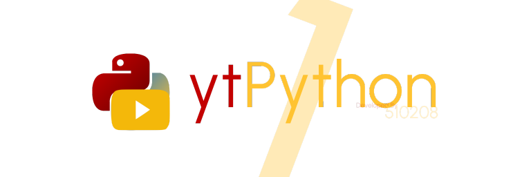
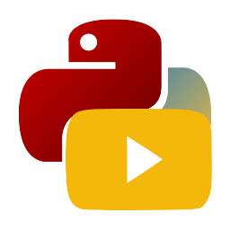

# ytPython

一款 YouTube 影片下載工具，基於 Python、PyTube 與 ffMPEG開發


## 這是什麼？

這是個很簡單的 Python 工具，可以下載 YouTube 影片

## 怎麼使用？

### 手動下載

> **Note:**
>
> 請先安裝Python 3.11(推薦，也可以使用更新版本，目前實測 3.10.6 以上皆正常)，安裝後啟動命令終端(命令提示字元，cmd，其他作業系統請自行查詢)輸入以下指令：

```bash
pip install ttkthemes pytube moviepy mutagen pillow
```

> **Note:**
>
> 請先安裝ffMpeg，將ffMpeg二進制檔案解壓進main.py所在資料夾即可
再來前往專案頁面：

[](https://github.com/510208/pyyt)

點擊右上角` <> Code `，選擇` Download Zip `即可下載壓縮檔，將該檔案解壓後放在任一資料夾，雙案執行`main.py`，等待跑碼即可。

完成，主介面如下：


### 使用預編譯版本

> Warn:
>
> 二進位編譯已放棄使用，請前往[手動編譯處](#手動下載)

首先，前往下載最新版本：

[-There?style=for-the-badge)](#)

解壓縮後檢查資料夾下是否有以下檔案：

```files
_internal
ffmpeg.exe
ffplay.exe
ffprobe.exe
pyyt.exe
```

如果有，那很完美。請直接雙按pyyt.exe，啟動會需要一點時間(一般在30秒到一分鐘左右)，啟動成功後會看到以下介面：


這樣你的 ytPython 應該好了，請在最上方的輸入框輸入你的影片網址，這套軟體支持但不限於以下格式：

- `youtube.com/watch?v=<影片ID>`
- `youtube.com/shorts/<影片ID>`
- `www.youtube.com/watch?v=<影片ID>`
- `www.youtube.com/shorts/<影片ID>`
- 帶 https 或 http 協定的上述連結
- www 開頭的上述連結
- 其他...

先點擊查詢資訊按鈕，它可能會稍微卡住一段時間(通常在幾分鐘內)，耐心等候直到恢復回應。恢復後程式在按鈕底下的選單會正常，請點開這個選單並選擇適合的下載類型與畫質(或音質)。

緊接著，將底下的路徑選成自己要的下載路徑，預設是使用者下載資料夾。選完後請單按下載按鈕，程式會開始依照指定配置執行。待執行完畢後，系統底下會顯示完成訊ㄒ一，終端視窗中也會有這段訊息。然後你就可以開始享受自己的音樂饗宴了！

> **Note:**
> 
> 倘若選擇了影片下載，程式會先分開下載影片與音訊兩段檔案，緊接著用 ffMpeg 合併這兩個檔案。如果在合併的過程停斷很久，這是正常的，因為程式正在逐幀合併檔案。如果根目錄底下沒有ffMpeg相關檔案，主程式會拒絕執行並強制退出，請先行安裝ffMpeg(將bin中的三個檔案解壓到跟主程式相同目錄下)

## 使用方法

先點擊查詢資訊按鈕，它可能會稍微卡住一段時間(通常在幾分鐘內)，耐心等候直到恢復回應。恢復後程式在按鈕底下的選單會正常，請點開這個選單並選擇適合的下載類型與畫質(或音質)。

緊接著，將底下的路徑選成自己要的下載路徑，預設是使用者下載資料夾。選完後請單按下載按鈕，程式會開始依照指定配置執行。待執行完畢後，系統底下會顯示完成訊ㄒ一，終端視窗中也會有這段訊息。然後你就可以開始享受自己的音樂饗宴了！

> **Note:**
> 
> 倘若選擇了影片下載，程式會先分開下載影片與音訊兩段檔案，緊接著用 ffMpeg 合併這兩個檔案。
> 
> 如果在合併的過程停斷很久，這是正常的，因為程式正在逐幀合併檔案。如果根目錄底下沒有ffMpeg相關檔案，主程式會拒絕執行並強制退出，請先行安裝ffMpeg(將bin中的三個檔案解壓到跟主程式相同目錄下)

## 協助開發

如果你想要協助我們的開發，請開啟 Issue 或 Pull Request 詢問，在我們檢查後會將你的 PR 拉過來，在 GitHub 就會顯示你的資訊了。

## 目前貢獻者

這些是協助了主程式的開發的人

- 510208： 主程式碼

但如果沒有這些模組，也不會有 ytPython 的存在：

| 模組 | 功能 |
|:---|:---:|
| PyTube | 下載 YouTube 影片的核心 |
| ttkThemes | 美化介面 |
| MoviePy | 執行影音檔合併 |
| mutaGen | 管理 ID3 標籤 |
| pillow | 影像處理(GUI的Logo) |
| VSCode | 程式碼編輯與除錯 |
|  | 還有更多... |

以及您的使用，謝謝！

## 授權條款

此專案採用 [GNU Public License v3.0](LICENSE) 開源授權條款開放給大眾使用，以下是允許與不允許的操作：

### 可以做的事情

- **商業使用：** 你可以將軟體用於商業目的，不需要支付任何費用。
- **修改：** 你可以修改軟體的源碼並創建自己的版本。
- **分發：** 你可以將軟體的副本分發給其他人。
- **專利權使用：** 該授權提供了專利權的明確授權。
- **私人使用：** 你可以為自己的目的使用軟體，不需要公開你的修改。

### 不可以做的事情

- **將軟體子許可：** 你不能將軟體授權給其他人使用，除非他們也同意遵守 GPLv3。
- **將軟體與不兼容的授權合併：** 你不能將 GPLv3 軟體與使用不兼容授權的軟體合併。

### 需要注意的事情

- **開源：** 如果你分發 GPLv3 軟體或其衍生作品，你必須提供源碼。
- **維持原始授權：** 你必須在分發 GPLv3 軟體或其衍生作品時，保留 GPLv3 授權。

[](LICENSE)

<center></center>